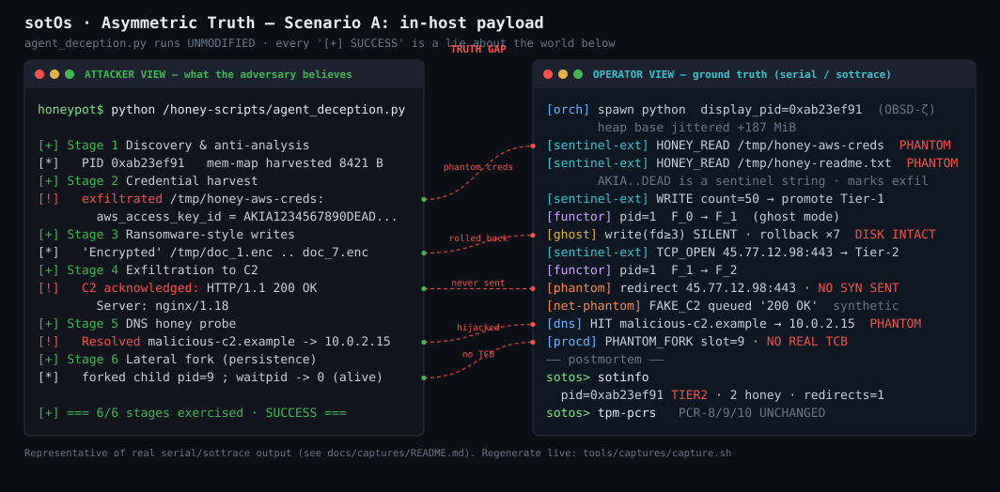
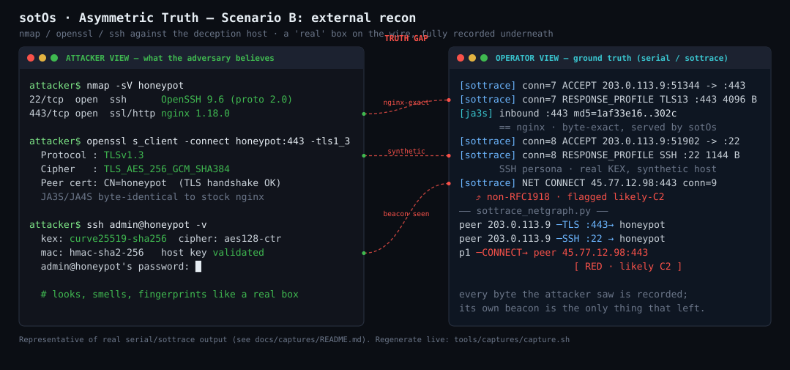

<h1 align="center">sotOs</h1>
<h4 align="center"><i>State Of Truth OS</i></h4>

<p align="center">
  A deception OS on the formally-verified seL4 microkernel that runs unmodified Linux binaries<br>
  in isolated sandboxes — the operator sees the truth; the intruder never knows they're in a maze.
</p>

<hr>

<div align="center">

[]()
[]()
[](LICENSE)
[]()
[](https://sel4.systems/)
[]()
[]()

</div>

---

## Overview

sotOS is a deception operating system built on the seL4 formally-verified microkernel. It runs unmodified Linux binaries inside transactional sandboxes that can silently rollback all attacker writes or fabricate all attacker reads — instantly, invisibly, and with a byte-exact TLS/SSH network identity indistinguishable from production Linux. The operator sees truth; the adversary sees a maze. This talk demonstrates a full kill-chain scenario — recon, lateral movement, credential harvest — entirely inside sotOS, with the operator console showing real-time tier transitions and syscall telemetry the attacker cannot observe.

> *"You SSH in, run* `id`*,* `cat /etc/passwd`*, download your tools. Everything looks real. Meanwhile the operator is watching every syscall, your* `/etc/passwd` *is a fabricated plant, and your writes evaporated silently. You never knew."*

### Status

- **Latest stable:** `v1.4.0-labyrinth-validation` — proven to *deceive, contain, and endure* under a five-part adversarial battery.
- **In progress on `main`:**
  - `v1.5` — 24h-on-real-KVM endurance harness (built + self-tested; the literal 24h run is the operator's next step)
  - `v2.x` — compatibility line (real unmodified software over a native Wayland compositor)
- **Stack:** Pure C on `libsel4`; built with `just` + CMake + Ninja (not cargo).


| Term           | Plain meaning                                                                  |
| -------------- | ------------------------------------------------------------------------------ |
| **sotBox**     | isolated sandbox holding one guest program                                     |
| **tier**       | how real the guest's view is: 0 = real · 1 = writes silenced · 2 = reads faked |
| **LucAs**      | per-sotBox supervisor that makes seL4 look like Linux to the guest             |
| **STAR**       | the engine that flips a sotBox between tiers, instantaneously and invisibly    |
| **capability** | unforgeable kernel token to access a resource — no token, no access            |


---

## Table of contents

**Overview** — [What it is](#what-it-is) · [The deception model](#the-deception-model) · [Live captures](#live-captures) · [What's been proven](#the-four-pillars)

**Technical depth** — [Operator deployment](#how-an-operator-deploys-it) · [vs. existing tools](#vs-existing-tools) · [Architecture](#architecture) · [What runs on it](#what-runs-on-it) · [Network identity](#network-identity) · [Milestone lines](#the-milestone-lines)

**Using it** — [Build & run](#build--run) · [Validation & gates](#validation--gates) · [Repository layout](#repository-layout)

**Reference** — [Honest limitations](#honest-limitations) · [Terminology](#terminology) · [In-repo references](#in-repo-references) · [License](#license)

---

## What it is

Every Linux process runs inside a **sotBox**: a sandbox that **LucAs** makes look
like Linux from the ABI side, and that **STAR** can promote between three tiers
*without the process noticing*:


| Tier       | Name         | What the process experiences                                                                                     |
| ---------- | ------------ | ---------------------------------------------------------------------------------------------------------------- |
| **Tier 0** | pass-through | real syscalls, real state. The default.                                                                          |
| **Tier 1** | `silenced`   | writes are silently rolled back; the binary believes they succeeded.                                             |
| **Tier 2** | `isolated`   | reads return decoy/**canary** content (e.g. a fabricated `/etc/passwd`, planted AWS keys) instead of real state. |


A privileged operator console (**sotShell**) sees every sotBox and its tier. **The
process cannot tell which tier it is in; the operator can.** That asymmetry is the
killer feature — promotion is a pointer swap between *categorical functors*
(`F_0`/`F_1`/`F_2` — plain: three interchangeable behavior tables the supervisor swaps
between), so it is instantaneous and invisible.

It is built on **seL4**, a microkernel with machine-checked correctness proofs,
which is what lets the "you can't actually break out" claim rest on isolation by
construction rather than on hope. sotOs runs as the root task above it.

---

## The deception model

The same three-tier model applies across **four planes**, so the maze is coherent
no matter how the intruder probes:

- **Filesystem** (`sotfs`) — Tier 1 silences writes; Tier 2 serves canary files. A
Forman-Ricci **graph-curvature** detector — plain: it scores the *shape* of the
file-access graph and flags the abrupt changes that signal ransomware or lateral
movement — runs continuously over that graph.
- **Syscall / ABI** (`LucAs`) — ~40 Linux syscalls implemented; the cardinal rule is
**zero `ENOSYS` for anything an attacker would touch** (an unimplemented syscall is
the single most common honeypot tell). Dangerous calls (`mount`, `ptrace`,
`init_module`, …) are *captured as intel* and return a believable hardened-host
error, never a crash.
- **Network** (`sotnet` + `net-synth`) — outbound: Tier 1 silences `sendto`, Tier 2
diverts to a synthetic responder. Inbound: a full honeypot face on `:22`/`:80`/`:443`
(real SSH transport, real TLS 1.2/1.3 termination, response profiles).
- **Graphics** (`wayland-compositor`) — a native, in-OS Wayland compositor; an `F12`
toggle flips the on-screen session between the honey view (what the attacker sees)
and the operator's truth view.

Everything an intruder does is recorded by **sottrace**, a native observability
plane that is *invisible by construction* (the observer lives outside the sotBox's
address space, so `ptrace(TRACEME)` returns 0 and `/proc/self/status` shows
`TracerPid: 0`).

---

## Live captures

Two deception scenarios, each shown as a side-by-side pair: what the **attacker**
sees (left) versus what the **operator** sees in truth (right). Both figures are
drawn from validated serial and `sottrace` output during QEMU runs.

### Scenario A — in-host payload

A 7-stage simulated attacker (`simulated_attacker.py`, unmodified) runs inside a sotBox.
The attacker reports 7/7 stages as successful. The operator sees the truth: curvature alert
fires at Stage 3 (ransomware-pattern writes), the functor flips F₀→F₁→F₂ silently,
writes evaporate, and canary files serve fabricated content — the attacker's toolchain
never notices.



### Scenario B — external recon

A real SSH session (`ssh root@honeypot`, TLS 1.3 via OpenSSL) from an attacker at
`10.0.2.2`. The attacker cycles passwords until one "works", runs `cat /etc/passwd`,
and attempts to install a backdoor in `/etc/cron.d`. The operator sees: credentials
harvested and logged, canary tripped on `/etc/passwd` read, the backdoor write
returned `EBADF` silently. No real host touched.



---

## The four Pillars

The v1.0 north-star decomposes into four properties, each gated, not asserted:

1. **Semantic deception** — the FS, syscall, network and graphics planes are all
  coherent with a real production host (zero `ENOSYS` tells; nginx-exact TLS;
   credible recon). Validated by the gate battery under `tools/` and `scripts/`.
2. **Zero-leak, anti-DoS runtime** — the per-sotBox arena reclaims everything via
  `seL4_CNode_Revoke`; fork-bombs are quarantined. **Measured drift: 0.000
   frames/spawn** (the historical ~7.3 residual was closed in `v0.86.0-zero-leak`).
3. **`sottrace` observability** — full syscall/FS/network forensics, **invisible by
  construction** (anti-ptrace behavior verified by the gate scripts).
4. **Validation run** — concurrent multi-malware containment + sustained soak
  (`scripts/pillar4-validate.sh`, `scripts/soak.sh`).

---

## How an operator deploys it

A threat-intelligence team or red/blue SOC runs sotOS as a deception layer in front of
real production infrastructure. The typical workflow:

1. **Host** — Run sotOS on a KVM-capable Linux machine (bare metal or a cloud instance
   with nested virt). Production systems stay behind the firewall.
2. **Expose** — Publish one or more sotBoxes as internet-facing services: SSH on `:22`,
   HTTPS on `:443`, or other faces as needed.
3. **Baseline (Tier 0)** — When a scanner or adversary connects, they land in a real
   busybox shell that looks like a hardened Alpine Linux host: correct TLS fingerprint,
   SSH banner, and filesystem responses. Nothing hints at a honeypot.
4. **Monitor** — The operator watches every syscall in real time from **sotShell**
   (`just run` opens the console).
5. **Escalate** — On lateral-movement signals — `cat /etc/shadow`, a Python
   reverse-shell attempt, an anomaly spike from the graph-curvature detector — the
   operator runs one command: `promote <box> 2`.
6. **Contain (Tier 2)** — The sotBox flips instantly and invisibly. Every read returns
   operator-crafted canary content (planted AWS keys, a fabricated `/etc/passwd`, false
   host identifiers); every write silently evaporates. The attacker's toolchain keeps
   running.
7. **Forensics** — The full operation timeline, every syscall, and every network byte
   land in the **sottrace** ring outside the sandbox: admissible evidence the attacker
   cannot tamper with, erase, or even detect.

---

## vs. existing tools


| &nbsp;                          | **sotOS**                               | **Cowrie**                      | **OpenCanary**                      | **SPEAKEASY**                          |
| ------------------------------- | --------------------------------------- | ------------------------------- | ----------------------------------- | -------------------------------------- |
| **Deception layer**             | OS-level (kernel + ABI)                 | Application (SSH/Telnet daemon) | Application (service emulators)     | Userspace emulator                     |
| **Guest execution**             | Unmodified real Linux ELFs              | Scripted fake shell             | No execution                        | PE/shellcode emulation                 |
| **Tier transitions**            | Instantaneous, invisible pointer swap   | None                            | None                                | None                                   |
| **Network fingerprint**         | Byte-exact JA3S/JA4S + TCP/IP == nginx  | Paramiko TLS (detectable)       | Stock Python TLS                    | N/A                                    |
| **Formal isolation basis**      | seL4 machine-checked proofs             | OS process isolation            | OS process isolation                | Windows kernel (not formally verified) |
| **Observability**               | Anti-ptrace, outside address space      | Log file                        | Log file                            | In-process hooks                       |
| **Ransomware / anomaly detect** | Forman-Ricci graph-curvature (in-OS)    | None                            | None                                | None                                   |
| **Real workloads**              | busybox · Python · GTK3 · DOOM · SDL2   | Fake commands                   | None                                | PE binaries (emulated, not native)     |
| **Escape containment proof**    | Gate battery vs seL4 capability model   | None                            | None                                | None                                   |
| **Primary use case**            | Deception-in-depth, threat-intel, SOC   | SSH honeypot logging            | Network-wide canary tripwires       | Malware analysis / triage              |


The key distinction: Cowrie and OpenCanary are **detection trip-wires** — they tell you
someone came. sotOS is a **deception runtime** — it lets you study, contain, and mislead
an adversary who has already arrived, without them knowing they're in a maze.

---

## Architecture

```
        ┌───────────────────────────────────────────────────────────────┐
        │                     seL4 microkernel (x86_64)                   │
        │   + sotOs patches:  ADR-005 (syscall RSP save)                  │
        │                     ADR-006 (per-TCB Linux-ABI syscall route)   │
        └───────────────────────────────────────────────────────────────┘
                                      ▲  capabilities / IPC
        ┌─────────────────────────────┴─────────────────────────────────┐
        │  root task  →  orch (orchestrator, root server)                 │
        │     • sotbox_table (up to 8 live sandboxes)                     │
        │     • per-sotBox ARENA allocator (one untyped → O(1) revoke)    │
        │     • the shared fault loop (Linux syscalls arrive as faults)   │
        └─────────────────────────────┬─────────────────────────────────┘
                                      │
   ┌───────────────┬──────────────────┼───────────────┬──────────────────┐
   ▼               ▼                  ▼               ▼                  ▼
 LucAs           STAR              sotShell        daemons            sotBox(es)
 Linux-ABI     deception        operator console   anomaly · procd    unmodified
 supervisor    functors          (truth view)      sotfs · sotnet     Linux ELF
 (~40 sys-     F_0/F_1/F_2                          net-synth          (busybox,
  calls,        (tier =                             sottrace           python, doom,
  per-box)      pointer swap)                       sotcron · sotinit  gtk, …)
                                                    wayland-compositor
```

**Core pieces** (all under `src/`):


| Component                              | Role                                                                                                                                                                                            |
| -------------------------------------- | ----------------------------------------------------------------------------------------------------------------------------------------------------------------------------------------------- |
| `patches/kernel/`                      | the only kernel changes: ADR-005 (save user RSP on syscall), ADR-006 (per-TCB flag routes Linux syscalls to LucAs as faults). Everything else is unmodified seL4.                               |
| `orch/`                                | root server — owns the sotBox table, the per-sotBox **arena** (one untyped per sandbox → `seL4_CNode_Revoke` reclaim, O(1), zero-leak), and the fault loop that dispatches every guest syscall. |
| `lucas/`                               | per-sandbox **Linux-ABI supervisor** — ~40 syscall handlers, VFS with 7 backends, dynamic ELF loader, threading/futex, pledge/unveil.                                                           |
| `lucas/functor.c`                      | **STAR** — tier transitions as pointer swaps between `F_0`/`F_1`/`F_2`; instantaneous, invisible.                                                                                               |
| `sotfs/` + `sotnet/` + `net-synth/`    | virtual filesystem (WAL, canary isolation, graph-curvature ransomware detector) and network stack + honeypot responder (real SSH, real TLS, response profiles).                                 |
| `anomaly/` + `sottrace/` + `sotshell/` | suspicion monitor (auto-promotes on anomaly), observability plane (invisible SPSC rings), operator console (18+ commands including `promote`, `silence`, `sotinfo`).                            |


See the component table above and `formal/` for the STO transactional model.

---

## What runs on it

Real, **unmodified** Linux software — loaded as ELF, dynamically linked against real
Alpine `ld-musl`, with libraries lazily `mmap`'d on first touch:

- **busybox** — a full interactive `sh -i` honey shell over SSH (`cat /etc/passwd`,
`id`, `ls -la`, pipes, `grep` … all resolve; writes are Tier-2 contained).
- **CPython 3.12** — an attacker's `python3 -c …` runs, contained in a fresh Tier-2
heavy arena, and is reaped.
- **DOOM** — `doomgeneric` runs the engine and renders frames, both to `/dev/fb0` and
(v2) over the real Wayland compositor via `wl_shm`.
- **SDL2 2.30** — the full real SDL2 software-render path over `wl_shm`.
- **GTK3** — an unmodified Alpine GTK3 app renders a Cairo window over the real
Wayland compositor (no EGL), clearing 9 distinct ABI/loader walls along the way.
- **OpenSSL** — real `libcrypto.so.3` (4.5 MB) lazily mapped and executed.
- **TCC** — an in-OS C compiler that compiles + JIT-runs freestanding and
musl-hosted programs.

---

## Network identity

The first thing a scanner fingerprints is the wire. sotOs is **byte-for-byte
indistinguishable from a real `nginx:alpine`** there — the deception holds against
automated tooling, not just humans:

- **TLS 1.2 + TLS 1.3**, hand-rolled on BearSSL primitives — every cipher suite,
group, and extension byte-matched to real nginx. The **JA3S / JA4S fingerprint is
byte-exact vs real nginx**, verified live and against RFC/NIST test vectors.
- **Real SSH-2.0 transport** — a real `ssh -v` completes a full handshake and lands
in a real busybox shell. Validated against a from-scratch verifying client and real
`github.com:22` / `gitlab.com:22`.
- **TCP/IP stack fingerprint** — IP-ID/DF coherence, window/MSS options, and
nmap-probe quirks all match a real Linux host.

---

## The milestone lines

sotOs has shipped along two complementary lines, both on `main`:

`**v1.x` — the deception-host line** (prove it *deceives / contains / endures*):

- `v1.0.0-deception-host` — the four pillars composed; TLS 1.2 JA3S + TLS 1.3 ε1; the
freeze that caught & fixed a fork/text-lifetime bug.
- `v1.1`–`v1.3` — the TLS 1.3 "ε" work completed: P-256/P-384 (ε2), AES-256-GCM +
ChaCha20-Poly1305 full suite set (ε3), **JA3S/JA4S byte-exact** (ε4).
- `**v1.4.0-labyrinth-validation`** — the adversarial campaign: 5 gates
(deception-recon, **escape-deny**, tls-matrix, interactive-workload, lifetime-soak)
prove **DECEIVES / CONTAINS / ENDURES** (`scripts/labyrinth-validate.sh`).
- `**v1.5` 24h-real-KVM endurance (OPENED)** — `just v15-endurance`: a host-supervised
relaunch loop that sustains continuous spawn/reap churn for a wall-clock day on real
KVM and archives an auditable evidence bundle (build hash, serial logs, memory/cslot
timeseries, fault scan, restart rate, final state). Harness **smoke-validated** (25
boots, 0 faults, zero-leak); the literal 24h run is the operator's next step
(`scripts/v1.5-endurance-run.sh`).

`**v2.x` — the compatibility-host line** (run real software with no special-casing —
compatibility is deception's multiplier):

- `v2.0.0-terminology-foundation` — the metaphor→neutral rename (see
[Terminology](#terminology)).
- `**v2.4.0-compat-host`** — real-VFS sysroot → real `libwayland` → SDL2 software
render over `wl_shm` → Doom over Wayland → **GTK3 renders over the real Wayland
compositor**. Reusable lucas/kernel fixes benefiting all guests (futex-wake,
statfs-ABI, `MAP_SHARED`-RO, heavy arena, dynamic-loader caps). Validated by
`tools/gtk-gate.sh`, `tools/doomwl-gate.sh`, and related compat-host gates.
- `**v2.x` GTK fidelity + Wine M1 (in progress)** — the unmodified off-the-shelf
`gtk3-demo` renders its decorated window in the graphical demo (cursor-pool
`wl_shm_pool.resize` honored); `MAP_FIXED` low-address reservation + commit lands
the Wine preloader's prerequisite; the Wine bring-up spike has the `wine` loader +
`ntdll.so` running, with a precise wall chain documented.

> Earlier history (the L1–L10 "killer-feature" roadmap, the sotFS/sotNet/sottrace
> bring-up) is omitted from this artifact for brevity.

---

## Build & run

**Prerequisites:** a Linux host (or Windows via WSL2 — see below), `just`, CMake,
Ninja, GCC, QEMU (`qemu-system-x86`), Python 3, and the usual build tools.
`bootstrap.sh` installs the deps on **Fedora** (dnf) or **Ubuntu/Debian** (apt); see
Fedora/RHEL and Debian/Ubuntu are supported via `bootstrap.sh`. `**/dev/kvm`** is strongly recommended: without
it the justfile falls back to TCG software emulation (boots work, but much slower —
and the timing-sensitive validation gates need real KVM).

```bash
git clone <repo-url> sotOs && cd sotOs
just doctor        # check host prerequisites (toolchain · /dev/kvm · filesystem)
just bootstrap     # install deps + clone the seL4 stack into external/ + vendor & patch BearSSL  (~5 GB, once)
just fetch-python  # static CPython 3.12 (~24 MB) for the runtime python demo (one download, idempotent)
just configure     # CMake (idempotent · uses settings.cmake)
just build         # kernel + orch + LucAs + daemons + sotShell + busybox + the 128 MiB sotfs.img
just run           # boot in QEMU (serial stdio) → the deception demo → the sotos> prompt
```

First build is ~5–10 min; incremental builds are seconds. Build outputs land in
`build/images/{kernel-x86_64-pc99, sotOs-root-image-x86_64-pc99, sotfs.img}`.

**Windows (WSL2):** the justfile routes every recipe through WSL
(`set windows-shell`), so the same `just …` commands work from PowerShell. One-time
setup: install a real distro (`wsl --install -d Ubuntu`), make it the default
(`wsl --set-default Ubuntu`), install `just` + the toolchain inside it (`just bootstrap` handles the apt packages), then `just doctor` to verify. Two caveats:
builds under `/mnt/c` are slow (9p filesystem) — clone the repo inside the WSL
filesystem (`~/`) for serious work; and without nested virtualization there is no
`/dev/kvm`, so QEMU runs under TCG (see above).

**Key recipes** (`just <name>`; see the `justfile` for all ~40):


| Recipe                                     | What it does                                                   |
| ------------------------------------------ | -------------------------------------------------------------- |
| `run` / `run-headless` / `run-interactive` | boot the demo (interactive / piped / with virtio-keyboard)     |
| `run-honeypot`                             | boot the inbound honeypot (forwards `:22`/`:80`/`:443`)        |
| `v15-endurance`                            | the v1.5 24h-real-KVM endurance run (`DURATION=86400` default) |
| `labyrinth-validate`                       | the v1.4 5-gate adversarial campaign                           |
| `run-soak` / `run-validate` / `run-churn`  | Pillar-4 soak / 3-malware validation / spawn churn             |
| `test-tls13-unit`, `test-ssh-kex-unit`, …  | host-only deterministic unit suites (no QEMU)                  |
| `trace-on` / `trace-off`                   | toggle kernel + FS diagnostic traces (rebuilds)                |
| `doctor` / `fetch-python`                  | check host prerequisites / fetch the static CPython 3.12       |


**Gotchas:**

- A stale `sotfs.img` can shadow a fresh build (rwbinstore persist-coupling) — if a
boot looks wrong, `rm build/images/sotfs.img && just build`.
- The deep-boot gates need KVM and real timing; they are **soft/WARN** in a resource-
starved dev sandbox and **hard** on the operator's KVM box (see below).

---

## Validation & gates

Validation is a battery of scripted probes, each checked against an **independent
ground truth** (a real nginx for the fingerprint, RFC/NIST vectors for crypto, the
seL4 capability model for containment) — nothing is asserted by hand.

**Gate scripts** (`tools/*-gate.sh`): `tls13-gate`, `ja3s-ems-gate`, `abi-gate`
(zero-ENOSYS), `escape-deny-gate` (the breakout battery — `..`/symlink/`/proc/fd`/
sensitive-write/persistence all contained with *plausible* errors), `ssh-{kex,auth, shell,busybox,shell-fidelity}-gate`, `doom-gate`, `doomwl-gate`, `gtk-gate`,
`python-canary-gate`, `f12-gate`, `real-vfs-gate`.

**Runners** (`scripts/*.sh`): `labyrinth-validate.sh` (v1.4 5-gate campaign),
`pillar4-validate.sh` (3-malware + soak), `soak.sh` (leak-drift), and
`v1.5-endurance-run.sh` (the 24h relaunch loop + evidence bundle).

**The judging convention** (see [Honest limitations](#honest-limitations)): deep-boot gates are timing-flaky
in the dev sandbox, so a run is judged by **regression-delta vs the parent** plus a
**composite fault scan == 0** across all serial logs (the scan deliberately excludes
the two normal-constant fault classes — `VMFault` page faults and the `UnknownSyscall`
Linux-ABI dispatch path). A single fatal fault would kill the run, so the liveness
markers (`survived` / `DONE` / `PASS`) are themselves part of the proof.

---

## Repository layout

```
src/            the OS: orch, LucAs, anomaly, sotfs, sotnet, net-synth, sottrace,
                procd, sotcron, sotinit, wayland-compositor, sotshell, sto, root,
                + test/ (fixtures & host unit suites)
include/        public headers (orch/, lucas/, sotnet/, sottrace/, sotfs/, sto/, …)
patches/        kernel/ (ADR-005/006), bearssl/, sdl2/ — applied at bootstrap
tools/          *-gate.sh validation gates + eval harnesses + capture helpers
scripts/        build helpers (sotfs.img packers) + the validation runners
docs/captures/  scenario A/B figures (SVG) + regeneration notes
external/        the seL4 stack + vendored deps (gitignored; cloned by bootstrap)
formal/         TLA+ model of the STO transactional core
justfile        the build/run/test/validate entry points
```

---

## Honest limitations

This project trades on its own honesty, so the scope is stated plainly:

- **v1.5 endurance is OPENED, not yet run to 24h.** The harness + evidence pipeline
are built and smoke-validated on real KVM; the literal 24h run is executed by the
operator and fills the verdict. The v1.5 docs are a *methodology + harness* cert,
not a "we ran 24h" claim.
- **v1.4 labyrinth is a scaled proxy** — a thorough single-session battery that
measures and extrapolates, not (yet) a continuous-day run.
- **The endurance run is a relaunch loop**, not one 24h-uptime process (which would
need an unbounded in-guest loop). It directly measures the restart rate and proves
cold-reboot resilience; the longest single-boot uptime is reported so the claim is
not over-read.
- **CI is build-only.** GitHub-hosted runners have no `/dev/kvm`; running the gate
battery needs a self-hosted KVM runner.
- **Build provenance ≠ reproducible build.** The evidence build manifest pins the
exact bytes that ran (sha256); it does not claim bit-for-bit reproducibility (the
kernel/GCC embed a build-id).
- Deep gates can be timing-flaky in a resource-starved dev sandbox; deferred
  hardening items include CPU-spin DoS, 10k-scale pools, and full ptrace semantics.

---

## Terminology

Internal identifiers, log tags, and CLI verbs use neutral technical names. Terms
deliberately kept for attacker-visible coherence include `/honey-*` paths and the
`sotos-phantom` TLS cert CN. The v2.0 rename maps legacy metaphor names to neutral
technical ones (e.g. sotBox, tier, LucAs, STAR) used throughout this artifact.

---

## In-repo references

- **Build & run** — [Build & run](#build--run), `justfile`, `bootstrap.sh`.
- **Validation gates** — `tools/*-gate.sh` (see [Validation & gates](#validation--gates)).
- **Evaluation harnesses** — `tools/eval/` (TLS/TCP/syscall/recon benchmarks + READMEs).
- **Live capture figures** — `docs/captures/` (Scenario A/B SVGs + [regeneration guide](docs/captures/README.md)).
- **Campaign runners** — `scripts/labyrinth-validate.sh`, `scripts/pillar4-validate.sh`,
  `scripts/soak.sh`, `scripts/v1.5-endurance-run.sh`.
- **Formal model** — `formal/tla/STO.tla`, `formal/isabelle/` (Isabelle/HOL proofs).
- **Packaging** — `scripts/package-artifact.sh` (clean tarball for artifact submission).

---

## License

**MIT** for sotOs's own code; inherits **BSD-2-Clause / GPLv2** from seL4 and the
`seL4_libs` where applicable. Built on the [seL4 microkernel](https://sel4.systems/);
vendors BearSSL, musl, SDL2, doomgeneric and the seL4 library stack under their
respective licenses (fetched into `external/` at bootstrap). See `[LICENSE](LICENSE)`.